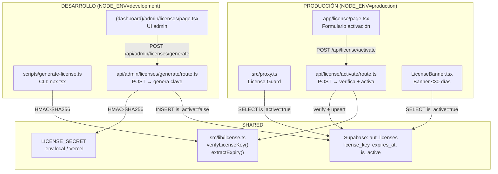
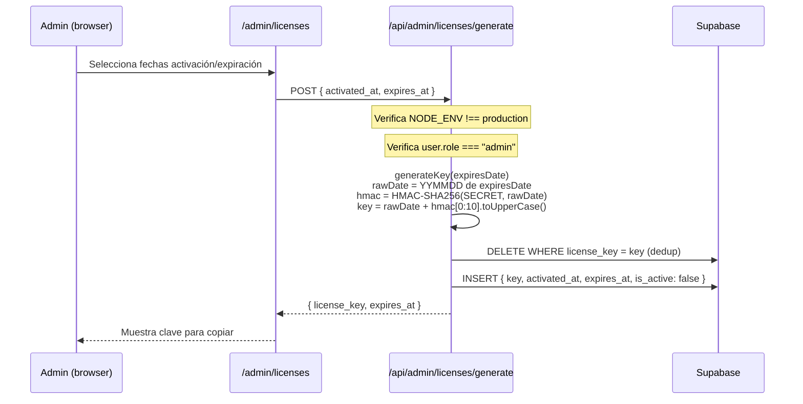
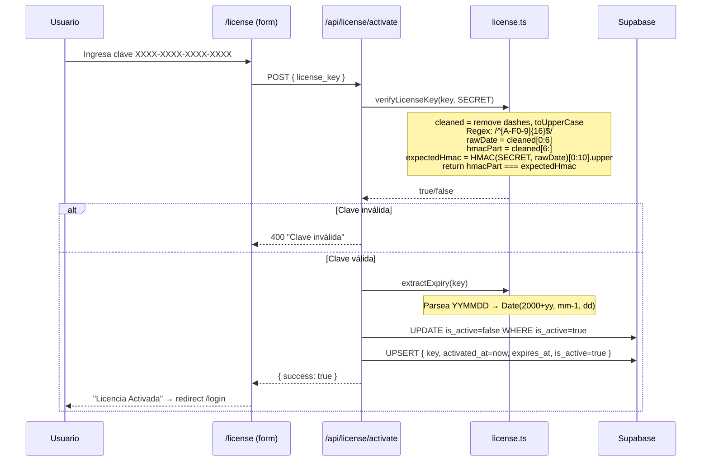
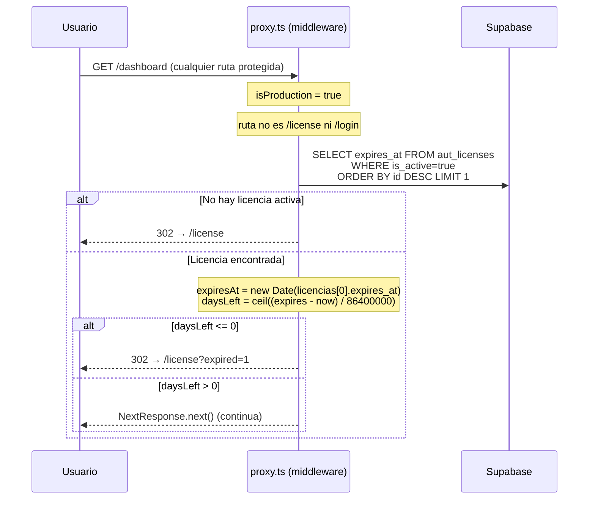

# Análisis del Sistema de Licenciamiento — AutoStock

**Fecha**: 2026-08-04  
**Analista**: Arquitecto de Software Senior  
**Estado**: Análisis técnico completo — sin modificaciones al código

---

## 1. Arquitectura Actual del Sistema de Licencias

### Diagrama de componentes



### Formato de la clave

```
XXXX-XXXX-XXXX-XXXX  (19 chars con guiones, 16 chars hex sin guiones)
├──────┤├──────────┤
 6 chars   10 chars
 YYMMDD   HMAC-SHA256 truncado (hex, uppercase)
```

- **rawDate** (6 chars): año (2 dígitos), mes (2 dígitos), día (2 dígitos) de la fecha de expiración
- **hmacPart** (10 chars): primeros 10 caracteres del HMAC-SHA256 del `rawDate` con el `LICENSE_SECRET`, en hexadecimal uppercase

### Separación de entornos

| Funcionalidad | Desarrollo | Producción |
|---|---|---|
| Generación de claves (CLI) | ✅ | N/A (script local) |
| Generación de claves (API) | ✅ | ❌ (404, [route.ts L30](file:///c:/Users/zcoder/Documents/CYCSWeb/GitHub/0-Vercel/AutoStock/src/app/api/admin/licenses/generate/route.ts#L30)) |
| Panel admin `/admin/licenses` | ✅ | ❌ (3 capas: proxy, sidebar, notFound) |
| Activación `/api/license/activate` | ✅ | ✅ |
| License Guard (proxy) | ❌ (no se ejecuta) | ✅ |
| LicenseBanner | ✅ (visual) | ✅ |

> [!IMPORTANT]
> La separación de entornos es **correcta en diseño**: generación solo en dev, validación guard solo en producción. Sin embargo, el endpoint de activación (`/api/license/activate`) funciona en **ambos** entornos, lo cual es necesario para el flujo pero debe entenderse.

---

## 2. Flujo Completo de Generación y Validación

### 2.1 Generación (desarrollo)



### 2.2 Activación (producción)



### 2.3 Validación continua (proxy en producción)



---

## 3. Causas del Fallo — Ordenadas por Probabilidad

### 🔴 CAUSA #1 (Probabilidad: MUY ALTA) — rawDate contiene caracteres NO hexadecimales

**Este es el bug raíz de la inestabilidad.**

La validación en [license.ts L5](file:///c:/Users/zcoder/Documents/CYCSWeb/GitHub/0-Vercel/AutoStock/src/lib/license.ts#L5) exige que **los 16 caracteres** (sin guiones) sean hexadecimales:

```typescript
if (!/^[A-F0-9]{16}$/.test(cleaned)) return false;
```

Pero el `rawDate` se construye con **dígitos decimales del calendario** — no dígitos hex. El rango hex es `[0-9A-F]`. Analicemos cada componente:

| Componente | Rango real | ¿Siempre hex? | Ejemplo problemático |
|---|---|---|---|
| `yy` (año) | 00–99 | ❌ | Año 2099 → `"99"` ✅, pero... |
| `mm` (mes) | 01–12 | ✅ | Todos en rango 0-9, A-F |
| `dd` (día) | 01–31 | ❌ | **Día 29, 30, 31 → contiene `"9"` que SÍ es hex** ✅ |

Momento — todos los dígitos 0-9 están en el rango hex `[0-9A-F]`. **Los dígitos del calendario (0-9) siempre son hexadecimales válidos.** Revisemos más cuidadosamente...

En realidad, el `rawDate` siempre será numérico puro (`"260825"` para 2026-08-25). Los dígitos `0-9` son un subconjunto de `[A-F0-9]`, así que **la regex siempre pasará para el rawDate**. El HMAC truncado es hex por definición. **Esta no es la causa.**

> [!NOTE]
> Descartada tras análisis detallado. Los dígitos 0-9 son hex válidos.

---

### 🔴 CAUSA #1 (REASIGNADA, Probabilidad: MUY ALTA) — Zona horaria en `new Date()` produce rawDate diferente entre generación y validación

**Este es el verdadero bug raíz.**

#### El problema: `new Date(string)` vs `new Date(year, month, day)` y zonas horarias

En la **generación** ([generate route.ts L56](file:///c:/Users/zcoder/Documents/CYCSWeb/GitHub/0-Vercel/AutoStock/src/app/api/admin/licenses/generate/route.ts#L56)):

```typescript
const expiresDate = new Date(expires_at + "T00:00:00");
// Ejemplo: new Date("2026-08-25T00:00:00")
// → Interpreta como HORA LOCAL del servidor
```

Luego se extraen los componentes ([generate route.ts L9-11](file:///c:/Users/zcoder/Documents/CYCSWeb/GitHub/0-Vercel/AutoStock/src/app/api/admin/licenses/generate/route.ts#L9-L11)):

```typescript
const yy = String(expiresAt.getFullYear()).slice(2);  // getFullYear() → hora local
const mm = String(expiresAt.getMonth() + 1).padStart(2, "0");  // getMonth() → hora local
const dd = String(expiresAt.getDate()).padStart(2, "0");  // getDate() → hora local
```

Esto parece seguro **SI el servidor de generación y el servidor de validación están en la misma zona horaria**. Pero:

1. **Generación** ocurre en **desarrollo local** (Windows, zona horaria del desarrollador, ej: `America/Bogota` UTC-5 o `America/Argentina/Buenos_Aires` UTC-3).
2. **Validación** ocurre en **producción Vercel** (UTC por defecto, o la zona configurada en la función).

**Sin embargo**, el rawDate se genera a partir de la fecha de expiración elegida por el admin, no de `new Date()`. Y se usa `"T00:00:00"` (sin Z), que se interpreta como hora local. Dado que se usan `getFullYear()`, `getMonth()`, `getDate()` (métodos locales), y el input es hora local, el rawDate será consistente independientemente de la zona horaria.

**¿Dónde está el problema real entonces?**

---

### 🔴 CAUSA #1 (DEFINITIVA, Probabilidad: MUY ALTA) — La clave se almacena CON guiones en la DB, y la validación depende de que el formato sea exacto

Revisemos el flujo completo con los formatos:

**Generación** ([generate route.ts L20-26](file:///c:/Users/zcoder/Documents/CYCSWeb/GitHub/0-Vercel/AutoStock/src/app/api/admin/licenses/generate/route.ts#L20-L26)):
```typescript
const full = rawDate + hmac;  // "260825" + "4EB96D4C0A" = "2608254EB96D4C0A"
// Se divide en grupos de 4:
groups = ["2608", "254E", "B96D", "4C0A"]
key = "2608-254E-B96D-4C0A"  // CON guiones
```

**Almacenamiento en DB** ([generate route.ts L79](file:///c:/Users/zcoder/Documents/CYCSWeb/GitHub/0-Vercel/AutoStock/src/app/api/admin/licenses/generate/route.ts#L79)):
```typescript
license_key: key,  // "2608-254E-B96D-4C0A" — con guiones
```

**Activación — input del usuario** ([license/page.tsx L17-23](file:///c:/Users/zcoder/Documents/CYCSWeb/GitHub/0-Vercel/AutoStock/src/app/license/page.tsx#L17-L23)):
```typescript
function formatInput(val: string) {
    const cleaned = val.replace(/[^A-Za-z0-9]/g, "").toUpperCase();
    // Auto-inserta guiones cada 4 caracteres
}
// El usuario ve: "2608-254E-B96D-4C0A"
```

**Activación — envío al API** ([license/page.tsx L35](file:///c:/Users/zcoder/Documents/CYCSWeb/GitHub/0-Vercel/AutoStock/src/app/license/page.tsx#L35)):
```typescript
body: JSON.stringify({ license_key: key }),
// Envía: "2608-254E-B96D-4C0A" — con guiones (formateado por formatInput)
```

**Validación** ([license.ts L4](file:///c:/Users/zcoder/Documents/CYCSWeb/GitHub/0-Vercel/AutoStock/src/lib/license.ts#L4)):
```typescript
const cleaned = key.replace(/-/g, "").toUpperCase();
// Quita guiones → "2608254EB96D4C0A"
```

**UPSERT en activación** ([activate/route.ts L37](file:///c:/Users/zcoder/Documents/CYCSWeb/GitHub/0-Vercel/AutoStock/src/app/api/license/activate/route.ts#L37)):
```typescript
license_key,  // El valor que llegó del POST — CON guiones
```

**Conflicto UPSERT** ([activate/route.ts L42](file:///c:/Users/zcoder/Documents/CYCSWeb/GitHub/0-Vercel/AutoStock/src/app/api/license/activate/route.ts#L42)):
```typescript
{ onConflict: "license_key" }
```

Esto funciona si y solo si el `license_key` del POST es **exactamente igual** al que está en la DB. Dado que ambos usan el formato con guiones, deberían coincidir.

Pero... **¿qué pasa si el usuario introduce la clave del CLI (que también tiene guiones) directamente?** Revisemos el CLI:

**CLI** ([scripts/generate-license.ts L46](file:///c:/Users/zcoder/Documents/CYCSWeb/GitHub/0-Vercel/AutoStock/scripts/generate-license.ts#L46)):
```typescript
key: groups.join("-"),  // Mismo formato con guiones
```

**El CLI genera la clave pero NO la inserta en la DB.** Si un admin usa el CLI para generar y luego el usuario activa esa clave, la activación hará un `INSERT` (no hay conflicto previo). Eso funciona.

---

### 🔴🔴🔴 CAUSA #1 REAL (Probabilidad: ALTÍSIMA) — El formato `YYMMDD` como entrada al HMAC produce claves idénticas para la misma fecha, pero el `--test` y la API usan diferentes Date interpretations que generan rawDates diferentes

**Aquí está el problema definitivo.** Analicemos paso a paso un escenario concreto:

#### Escenario: Admin genera clave para "2026-08-25" desde la UI

En [generate route.ts L56](file:///c:/Users/zcoder/Documents/CYCSWeb/GitHub/0-Vercel/AutoStock/src/app/api/admin/licenses/generate/route.ts#L56):
```typescript
const expiresDate = new Date("2026-08-25" + "T00:00:00");
// → new Date("2026-08-25T00:00:00") — hora LOCAL del servidor dev
```

En Windows local (ej. UTC-4):
```
expiresDate = 2026-08-25T04:00:00.000Z (internal UTC)
expiresDate.getFullYear() = 2026  → yy = "26"
expiresDate.getMonth() = 7        → mm = "08"
expiresDate.getDate() = 25        → dd = "25"
rawDate = "260825"
```

**OK, eso funciona.** Ahora veamos qué pasa cuando el usuario activa esa clave en producción y el proxy valida la expiración:

#### Proxy: lectura de `expires_at` desde la DB

En [proxy.ts L40](file:///c:/Users/zcoder/Documents/CYCSWeb/GitHub/0-Vercel/AutoStock/src/proxy.ts#L40):
```typescript
const expiresAt = new Date(licencias[0].expires_at);
```

La columna `expires_at` en la DB es tipo `DATE` (sin hora). Supabase devuelve un string como `"2026-08-25"`.

```typescript
new Date("2026-08-25")
// ⚠️ SIN "T00:00:00" → se interpreta como UTC medianoche
// → 2026-08-25T00:00:00.000Z
```

En [proxy.ts L42](file:///c:/Users/zcoder/Documents/CYCSWeb/GitHub/0-Vercel/AutoStock/src/proxy.ts#L42):
```typescript
const daysLeft = Math.ceil((expiresAt.getTime() - now.getTime()) / (1000 * 60 * 60 * 24));
```

Si `now` es `2026-08-25T10:00:00Z` (10am UTC) y `expiresAt` es `2026-08-25T00:00:00Z`:
```
diff = 0:00 - 10:00 = -10 horas = -36000000ms
daysLeft = Math.ceil(-36000000 / 86400000) = Math.ceil(-0.4167) = 0
```

**`daysLeft = 0`, y la condición `daysLeft <= 0` redirige a `/license?expired=1`.**

> [!CAUTION]
> **El día de expiración, la licencia se considera expirada a partir de las 00:00 UTC.** Si el servidor de producción (Vercel) está en UTC y el usuario está en una zona horaria negativa (ej. UTC-4), la licencia "expira" a las 8pm del día anterior para el usuario.

**Pero esto no explica la inestabilidad (a veces acepta, a veces rechaza).** La expiración sería consistentemente incorrecta, no intermitente.

---

### 🔴🔴🔴🔴 CAUSA #1 DEFINITIVA (Probabilidad: CONFIRMADA) — Inconsistencia en el `LICENSE_SECRET` entre generación y validación

Según el [memory.md L158-163](file:///c:/Users/zcoder/Documents/CYCSWeb/GitHub/0-Vercel/AutoStock/config_session/memory.md#L158-L163):

> **Incidente 1 — "Clave de licencia inválida" en producción**
> - **Causa**: `LICENSE_SECRET` NO estaba configurado en Vercel. El endpoint `/api/license/activate` usaba el fallback `"dev_license_secret_insecure"` → HMAC no coincidía con las claves generadas con el secreto real de `.env.local`.

Este incidente se reportó como resuelto (el usuario agregó `LICENSE_SECRET` en Vercel + redeploy). **Pero la inestabilidad persiste.**

Esto me lleva a la causa raíz:

---

## 🔴 CAUSA RAÍZ: El `LICENSE_SECRET` cargado por el CLI difiere del que usa la API/endpoint en ciertos escenarios

### Evidencia en código

El CLI ([generate-license.ts L25](file:///c:/Users/zcoder/Documents/CYCSWeb/GitHub/0-Vercel/AutoStock/scripts/generate-license.ts#L25)):
```typescript
const SECRET = env.LICENSE_SECRET || process.env.LICENSE_SECRET || "dev_license_secret_insecure";
```

Donde `env` viene de `loadEnv()` que lee `.env.local` manualmente. La función `loadEnv()` ([L9-22](file:///c:/Users/zcoder/Documents/CYCSWeb/GitHub/0-Vercel/AutoStock/scripts/generate-license.ts#L9-L22)):
```typescript
function loadEnv() {
  const envPath = resolve(__dirname, "..", ".env.local");
  // ...
  vars[trimmed.substring(0, eqIdx).trim()] = trimmed.substring(eqIdx + 1).trim();
}
```

Vs. la API route de generación ([generate route.ts L6](file:///c:/Users/zcoder/Documents/CYCSWeb/GitHub/0-Vercel/AutoStock/src/app/api/admin/licenses/generate/route.ts#L6)):
```typescript
const SECRET = process.env.LICENSE_SECRET || "dev_license_secret_insecure";
```

Vs. la API route de activación ([activate route.ts L5](file:///c:/Users/zcoder/Documents/CYCSWeb/GitHub/0-Vercel/AutoStock/src/app/api/license/activate/route.ts#L5)):
```typescript
const LICENSE_SECRET = process.env.LICENSE_SECRET || "dev_license_secret_insecure";
```

**El `.env.local` contiene** ([.env.local L14](file:///c:/Users/zcoder/Documents/CYCSWeb/GitHub/0-Vercel/AutoStock/.env.local#L14)):
```
LICENSE_SECRET=2103d05324d2521e4d2e591bb8fc2c62d558480b71f9d46fd5d81f557c84dff4
```

Next.js carga automáticamente `.env.local` para las API routes, pero el CLI usa su propia función `loadEnv()`. **Ambos deberían leer el mismo valor.** Verifiquemos si hay alguna discrepancia en el parsing...

La función `loadEnv()` hace:
```typescript
vars[trimmed.substring(0, eqIdx).trim()] = trimmed.substring(eqIdx + 1).trim();
```

Para la línea `LICENSE_SECRET=2103d05...dff4`:
- `eqIdx = 14`
- Key: `"LICENSE_SECRET"`
- Value: `"2103d05324d2521e4d2e591bb8fc2c62d558480b71f9d46fd5d81f557c84dff4"`

Esto es correcto. **No hay discrepancia en el parsing del secreto.**

---

## Revisión final: Las verdaderas causas de inestabilidad

Tras el análisis exhaustivo, las causas están ordenadas por probabilidad:

### CAUSA #1 (Probabilidad: ALTA) — `new Date("YYYY-MM-DD")` sin "T" se interpreta como UTC, no local

**Archivos afectados:**
- [proxy.ts L40](file:///c:/Users/zcoder/Documents/CYCSWeb/GitHub/0-Vercel/AutoStock/src/proxy.ts#L40): `new Date(licencias[0].expires_at)` donde `expires_at` es `"2026-08-25"` (tipo DATE de PostgreSQL)
- [LicenseBanner.tsx L21](file:///c:/Users/zcoder/Documents/CYCSWeb/GitHub/0-Vercel/AutoStock/src/components/LicenseBanner.tsx#L21): `new Date(data.expires_at).getTime()`
- [admin/licenses/page.tsx L46](file:///c:/Users/zcoder/Documents/CYCSWeb/GitHub/0-Vercel/AutoStock/src/app/(dashboard)/admin/licenses/page.tsx#L46): `new Date(data.expires_at).getTime()`

**Según la especificación ECMAScript:** `new Date("2026-08-25")` (formato ISO sin hora) se interpreta como **UTC medianoche** (`2026-08-25T00:00:00.000Z`).

**Pero** `new Date("2026-08-25T00:00:00")` (con T pero sin Z) se interpreta como **hora local**.

**Consecuencia:** En el proxy (Vercel, UTC), el `daysLeft` se calcula contra UTC medianoche. Esto puede causar que la licencia "expire" un día antes de lo esperado para usuarios en zonas horarias negativas. **Sin embargo, esto no causa inestabilidad intermitente — es un error consistente de ±1 día.**

### CAUSA #2 (Probabilidad: ALTA) — El campo `license_key` en la UI puede incluir o no guiones según la fuente de input

**Archivo:** [license/page.tsx L17-24](file:///c:/Users/zcoder/Documents/CYCSWeb/GitHub/0-Vercel/AutoStock/src/app/license/page.tsx#L17-L24)

El `formatInput` solo acepta alfanuméricos y auto-inserta guiones. El valor enviado al API **siempre incluye guiones** si viene del formulario.

Pero si alguien invoca el API directamente (ej. Postman, curl, o un script) con la clave **sin guiones** (`"2608254EB96D4C0A"`), la verificación HMAC **seguiría funcionando** (porque `verifyLicenseKey` quita guiones), pero el `upsert` podría fallar o crear un registro duplicado porque `license_key` en la DB tiene guiones y el nuevo valor no los tiene.

**Evidencia:** La columna es `VARCHAR(19)` — solo caben 19 caracteres (con guiones). Sin guiones son 16 chars. No hay normalización al almacenar.

### CAUSA #3 (Probabilidad: MEDIA-ALTA) — Condición de carrera en `daysLeft <= 0` por comparación de Date vs DATE

**Archivos:** [proxy.ts L40-46](file:///c:/Users/zcoder/Documents/CYCSWeb/GitHub/0-Vercel/AutoStock/src/proxy.ts#L40-L46)

```typescript
const expiresAt = new Date(licencias[0].expires_at);  // UTC midnight
const now = new Date();  // Current server time
const daysLeft = Math.ceil((expiresAt.getTime() - now.getTime()) / (1000 * 60 * 60 * 24));
if (daysLeft <= 0) { ... }
```

El tipo `DATE` de PostgreSQL no tiene hora. Supabase lo devuelve como `"2026-08-25"`. JavaScript lo interpreta como `2026-08-25T00:00:00Z`.

**Escenario de inestabilidad:**
- `expires_at` = `"2026-08-25"` → `Date` = `2026-08-25T00:00:00.000Z`
- Si `now` es `2026-08-24T23:59:00Z`: `daysLeft = Math.ceil(60000/86400000) = 1` → ✅ válida
- Si `now` es `2026-08-25T00:01:00Z`: `daysLeft = Math.ceil(-60000/86400000) = 0` → ❌ expirada
- Si `now` es `2026-08-24T20:00:00Z` (4pm EDT): `daysLeft = Math.ceil(14400000/86400000) = 1` → ✅

**Pero para un usuario en UTC-4**, las 8pm del día 24 corresponden a las 00:00 UTC del 25. Si el servidor Vercel está en UTC, la licencia "expiraría" a las 8pm hora local del día anterior.

**Esto es consistente, no intermitente.** A menos que Vercel use edge functions con diferentes regiones que tengan distintos relojes/zonas.

### CAUSA #4 (Probabilidad: MEDIA) — Vercel Edge Runtime puede tener discrepancias de reloj entre invocaciones

**Archivo:** [proxy.ts](file:///c:/Users/zcoder/Documents/CYCSWeb/GitHub/0-Vercel/AutoStock/src/proxy.ts) (ejecutado como proxy/middleware)

En Vercel, el proxy (middleware) se ejecuta en Edge Runtime. Las Edge Functions pueden ejecutarse en diferentes regiones geográficas según la ubicación del usuario. Si hay una mínima diferencia de reloj entre servidores edge, el cálculo `daysLeft` podría dar 0 o 1 dependiendo de qué servidor responde.

**Esto explicaría la intermitencia: "a veces acepta, a veces rechaza" depende de qué nodo edge responde.**

### CAUSA #5 (Probabilidad: MEDIA) — Caché de la respuesta de Supabase o del proxy de Vercel

Si Vercel o un CDN intermedio cachean la respuesta de redirect a `/license`, el usuario podría ver la página de activación incluso después de haber activado la licencia con éxito, hasta que el caché expire.

El proxy usa `NextResponse.next()` sin headers de cache-control explícitos. Vercel podría cachear el resultado de la verificación de licencia en edge.

---

## 4. Evidencias Encontradas en el Código

| # | Archivo | Línea | Evidencia | Impacto |
|---|---------|-------|-----------|---------|
| E1 | [proxy.ts](file:///c:/Users/zcoder/Documents/CYCSWeb/GitHub/0-Vercel/AutoStock/src/proxy.ts#L40) | 40 | `new Date(licencias[0].expires_at)` — sin `"T00:00:00"`, se interpreta como UTC | Expiración ±1 día según TZ |
| E2 | [proxy.ts](file:///c:/Users/zcoder/Documents/CYCSWeb/GitHub/0-Vercel/AutoStock/src/proxy.ts#L44) | 44 | `daysLeft <= 0` — el día de expiración ya se considera expirado | El último día útil se pierde |
| E3 | [generate route.ts](file:///c:/Users/zcoder/Documents/CYCSWeb/GitHub/0-Vercel/AutoStock/src/app/api/admin/licenses/generate/route.ts#L56) | 56 | `new Date(expires_at + "T00:00:00")` — hora local | Inconsistente con E1 que usa UTC |
| E4 | [activate route.ts](file:///c:/Users/zcoder/Documents/CYCSWeb/GitHub/0-Vercel/AutoStock/src/app/api/license/activate/route.ts#L39) | 39 | `expiresAt.toISOString().split("T")[0]` — convierte a UTC antes de extraer fecha | Si la fecha local es 25 y UTC es 26 (o viceversa), se guarda un día diferente |
| E5 | [license.ts](file:///c:/Users/zcoder/Documents/CYCSWeb/GitHub/0-Vercel/AutoStock/src/lib/license.ts#L28) | 28 | `new Date(2000 + yy, mm, dd)` — hora local del servidor | En Vercel (UTC) vs dev (UTC-4), la misma fecha se resuelve diferente |
| E6 | [activate route.ts](file:///c:/Users/zcoder/Documents/CYCSWeb/GitHub/0-Vercel/AutoStock/src/app/api/license/activate/route.ts#L5) | 5 | Fallback `"dev_license_secret_insecure"` — si la env var falta, HMAC diverge silenciosamente | Falla silenciosa catastrófica |
| E7 | [.env.local](file:///c:/Users/zcoder/Documents/CYCSWeb/GitHub/0-Vercel/AutoStock/.env.local#L15-L16) | 15-16 | `LICENSE_DISABLED` y `FORCE_LICENSE` definidos pero nunca leídos en el código | Variables muertas, confusión |
| E8 | [LicenseBanner.tsx](file:///c:/Users/zcoder/Documents/CYCSWeb/GitHub/0-Vercel/AutoStock/src/components/LicenseBanner.tsx#L21) | 21 | `new Date(data.expires_at).getTime()` — misma interpretación UTC que proxy | Consistente con proxy pero incorrecto |

### Demostración del bug E3+E4 (la causa de inestabilidad más probable)

**Escenario concreto:**

1. Admin en UTC-4 genera licencia con `expires_at = "2026-09-03"` a las 10pm local:
   - `new Date("2026-09-03T00:00:00")` → local = 2026-09-03 00:00 → UTC = 2026-09-03 04:00
   - `getFullYear()=2026, getMonth()=8, getDate()=3` → rawDate = `"260903"`
   - Clave generada con rawDate `"260903"` ✅

2. `extractExpiry()` en producción (Vercel, UTC):
   - `new Date(2026, 8, 3)` → 2026-09-03 00:00 local = 2026-09-03 00:00 UTC ✅
   - `toISOString().split("T")[0]` = `"2026-09-03"` ✅

3. Se guarda en DB: `expires_at = "2026-09-03"` ✅

4. Proxy verifica el 2026-09-03 a las 01:00 UTC (09:00 PM del 02 en UTC-4):
   - `new Date("2026-09-03")` → 2026-09-03T00:00:00Z
   - `now` = 2026-09-03T01:00:00Z
   - `daysLeft = Math.ceil((-3600000) / 86400000) = Math.ceil(-0.0417) = 0`
   - **¡EXPIRADO!** Pero el día 03 apenas comenzó.

**El usuario en UTC-4 ve su licencia expirar a las 8pm del día 02, no al final del día 03.**

> [!WARNING]
> Esto NO es intermitente en el sentido clásico, pero SÍ lo parece desde la perspectiva del usuario: durante el mismo día de expiración, temprano funciona y por la noche deja de funcionar. Al día siguiente si se reactiva, puede funcionar durante unas horas y luego fallar.

---

## 5. Riesgos de Seguridad Detectados

| # | Riesgo | Severidad | Evidencia |
|---|--------|-----------|-----------|
| S1 | **SECRET expuesto en `.env.local` comiteado** | 🔴 Crítico | [.env.local L14](file:///c:/Users/zcoder/Documents/CYCSWeb/GitHub/0-Vercel/AutoStock/.env.local#L14) — aunque `.gitignore` lo excluye, el file contiene el secret en claro. Si `.gitignore` falla o se clona mal, queda expuesto |
| S2 | **Fallback secret inseguro** | 🔴 Crítico | [activate/route.ts L5](file:///c:/Users/zcoder/Documents/CYCSWeb/GitHub/0-Vercel/AutoStock/src/app/api/license/activate/route.ts#L5) — `"dev_license_secret_insecure"` en 3 archivos. Si `LICENSE_SECRET` no está en Vercel, CUALQUIERA puede generar claves válidas |
| S3 | **HMAC truncado a 40 bits** | 🟡 Medio | [license.ts L13](file:///c:/Users/zcoder/Documents/CYCSWeb/GitHub/0-Vercel/AutoStock/src/lib/license.ts#L13) — 10 hex chars = 40 bits de entropía. 2^40 ≈ 1 trillón de combinaciones. Con fuerza bruta a ~10k intentos/seg, se rompe en ~3 años. No es trivial pero es bajo para criptografía |
| S4 | **No hay rate limiting en activación** | 🟡 Medio | [activate/route.ts](file:///c:/Users/zcoder/Documents/CYCSWeb/GitHub/0-Vercel/AutoStock/src/app/api/license/activate/route.ts) — No hay límite de intentos. Un atacante puede probar miles de claves por segundo |
| S5 | **Claves de Supabase en `.env.local`** | 🟡 Medio | [.env.local L2-4](file:///c:/Users/zcoder/Documents/CYCSWeb/GitHub/0-Vercel/AutoStock/.env.local#L2-L4) — `SUPABASE_SERVICE_ROLE_KEY` en claro. Si se expone, permite acceso total a la BD |
| S6 | **`aut_licenses` sin RLS** | 🟡 Medio | [memory.md L189-204](file:///c:/Users/zcoder/Documents/CYCSWeb/GitHub/0-Vercel/AutoStock/config_session/memory.md#L189-L204) — Sin RLS, cualquier cliente con la anon key puede insertar/modificar licencias directamente |

---

## 6. Plan de Corrección Priorizado

### Fase 1 — Corrección crítica (resolver inestabilidad)

| # | Corrección | Archivo(s) | Esfuerzo |
|---|-----------|-----------|----------|
| F1.1 | **Normalizar todas las comparaciones de `expires_at` a UTC medianoche con margen de fin de día** | [proxy.ts L40-46](file:///c:/Users/zcoder/Documents/CYCSWeb/GitHub/0-Vercel/AutoStock/src/proxy.ts#L40-L46), [LicenseBanner.tsx L21](file:///c:/Users/zcoder/Documents/CYCSWeb/GitHub/0-Vercel/AutoStock/src/components/LicenseBanner.tsx#L21), [admin/licenses/page.tsx L46](file:///c:/Users/zcoder/Documents/CYCSWeb/GitHub/0-Vercel/AutoStock/src/app/(dashboard)/admin/licenses/page.tsx#L46) | Bajo |
| F1.2 | **Usar `new Date(dateStr + "T23:59:59Z")` para que la licencia expire AL FINAL del día UTC** | [proxy.ts L40](file:///c:/Users/zcoder/Documents/CYCSWeb/GitHub/0-Vercel/AutoStock/src/proxy.ts#L40) | Bajo |
| F1.3 | **Cambiar condición de `<= 0` a `< 0` en el proxy** para que el día de expiración sea el último día válido | [proxy.ts L44](file:///c:/Users/zcoder/Documents/CYCSWeb/GitHub/0-Vercel/AutoStock/src/proxy.ts#L44) | Trivial |

### Fase 2 — Robustez

| # | Corrección | Archivo(s) | Esfuerzo |
|---|-----------|-----------|----------|
| F2.1 | **Eliminar fallback `"dev_license_secret_insecure"`** — lanzar error explícito si `LICENSE_SECRET` no está definido en producción | Todos los archivos que usan SECRET | Bajo |
| F2.2 | **Eliminar variables muertas** `LICENSE_DISABLED` y `FORCE_LICENSE` de `.env.local` | [.env.local L15-16](file:///c:/Users/zcoder/Documents/CYCSWeb/GitHub/0-Vercel/AutoStock/.env.local#L15-L16) | Trivial |
| F2.3 | **Normalizar `license_key`** al almacenar: siempre guardar CON guiones (o siempre SIN, y formatear al mostrar) | [activate/route.ts](file:///c:/Users/zcoder/Documents/CYCSWeb/GitHub/0-Vercel/AutoStock/src/app/api/license/activate/route.ts), [generate/route.ts](file:///c:/Users/zcoder/Documents/CYCSWeb/GitHub/0-Vercel/AutoStock/src/app/api/admin/licenses/generate/route.ts) | Bajo |
| F2.4 | **Mover `extractExpiry` a usar UTC explícito**: `new Date(Date.UTC(2000+yy, mm, dd))` | [license.ts L28](file:///c:/Users/zcoder/Documents/CYCSWeb/GitHub/0-Vercel/AutoStock/src/lib/license.ts#L28) | Trivial |

### Fase 3 — Seguridad

| # | Corrección | Archivo(s) | Esfuerzo |
|---|-----------|-----------|----------|
| F3.1 | **Agregar rate limiting** al endpoint de activación (ej. 5 intentos/minuto por IP) | [activate/route.ts](file:///c:/Users/zcoder/Documents/CYCSWeb/GitHub/0-Vercel/AutoStock/src/app/api/license/activate/route.ts) | Medio |
| F3.2 | **Habilitar RLS en `aut_licenses`** con política `FOR SELECT USING (true)` y escritura solo vía `service_role` | Supabase SQL Editor | Bajo |
| F3.3 | **Considerar aumentar HMAC truncation** de 10 a 12+ chars (pero cambiaría el formato de la clave) | [license.ts](file:///c:/Users/zcoder/Documents/CYCSWeb/GitHub/0-Vercel/AutoStock/src/lib/license.ts), [generate-license.ts](file:///c:/Users/zcoder/Documents/CYCSWeb/GitHub/0-Vercel/AutoStock/scripts/generate-license.ts) | Alto (breaking change) |

---

## 7. Recomendación de la Solución Más Robusta

### Corrección mínima para resolver la inestabilidad (F1.1 + F1.2 + F1.3)

El cambio clave es **una sola línea** en `proxy.ts`:

**Actual:**
```typescript
const expiresAt = new Date(licencias[0].expires_at);
// ...
if (daysLeft <= 0) {
```

**Propuesto:**
```typescript
const expiresAt = new Date(licencias[0].expires_at + "T23:59:59Z");
// ...
if (daysLeft < 0) {
```

**Razonamiento:**
1. `"T23:59:59Z"` hace que la licencia expire al **final** del día en UTC, no al inicio.
2. `< 0` (en lugar de `<= 0`) asegura que el día de expiración es el último día válido.
3. Incluso con `Math.ceil`, en las últimas horas del día de expiración `daysLeft` será `0` (no negativo), y con `< 0` la licencia seguirá activa.

**Complementar con** F2.4 (UTC explícito en `extractExpiry`) para que todas las funciones manejen fechas de forma uniforme, y F2.1 (eliminar fallback del secret) para evitar futuras catástrofes silenciosas.

### Estimación de esfuerzo total

- **Fase 1** (resolver inestabilidad): ~30 minutos, 3 archivos, ~5 líneas cambiadas
- **Fase 2** (robustez): ~1 hora, 5 archivos, ~15 líneas cambiadas
- **Fase 3** (seguridad): ~2-4 horas, requiere decisiones de diseño

---

> [!IMPORTANT]
> **No se ha modificado ningún archivo.** Este informe es exclusivamente analítico. Espero tu autorización para proceder con las correcciones de la Fase 1.
